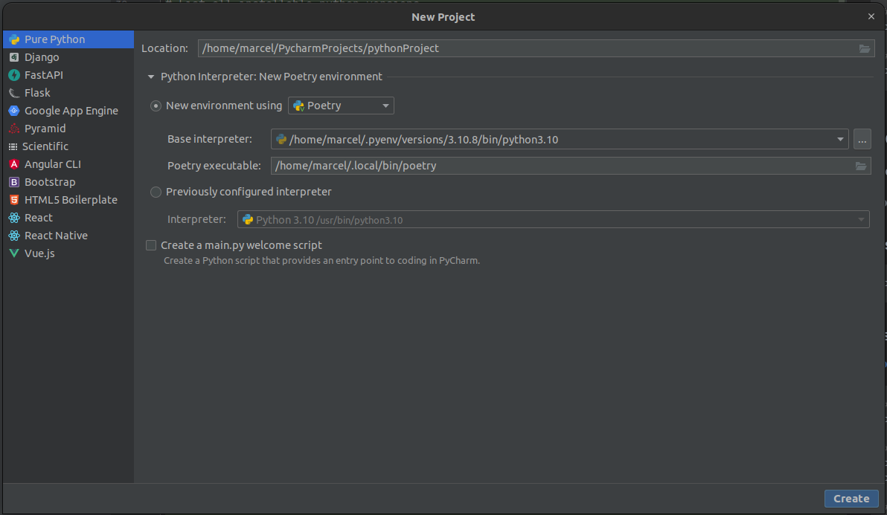
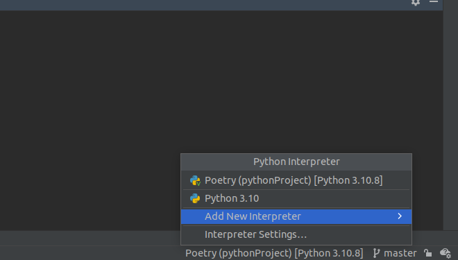
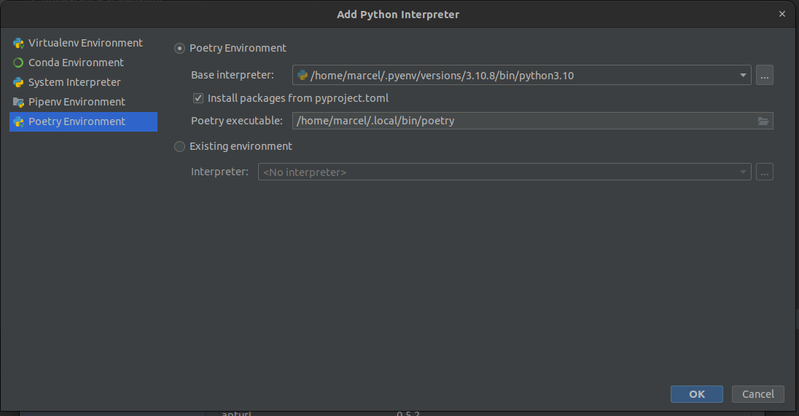

# Python 3 Setup with Pyenv and Poetry

## Pyenv

pyenv lets you easily switch between multiple versions of Python. It's simple, unobtrusive, and follows the UNIX
tradition of single-purpose tools that do one thing well.

Python versions will be installed in your home directory and therefor won't crash your main python installation

More detailed info on the [github page](https://github.com/pyenv/pyenv)

### Install pyenv

```shell
curl https://pyenv.run | bash
```

Some additional packages
```shell
sudo apt update; sudo apt install build-essential libssl-dev zlib1g-dev \
libbz2-dev libreadline-dev libsqlite3-dev curl git \
libncursesw5-dev xz-utils tk-dev libxml2-dev libxmlsec1-dev libffi-dev liblzma-dev
```

Add to ~/.bashrc

```shell
export PYENV_ROOT="$HOME/.pyenv"
command -v pyenv >/dev/null || export PATH="$PYENV_ROOT/bin:$PATH"
eval "$(pyenv init -)"
```

### Usage of pyenv

```shell
# Install python 3.10
pyenv install 3.10

# List all installable python versions
pyenv install -l

# Show installed versions
pyenv versions

# Set the version globally (mostly not needed because we use Pycharm to set it for the project)
pyenv global 3.10.4
```

## Poetry

Poetry manages dependencies and help to create packages

More detailed info on the [official website](https://python-poetry.org/)

### Install Poetry

```shell
curl -sSL https://install.python-poetry.org | python3 -

# Change setting to create venv folder in project
poetry config virtualenvs.in-project true
```

### Usage of Poetry

[More info on detailed basic usage](https://python-poetry.org/docs/basic-usage/)

```shell
# Create a new project (This can also be done via Pycharm. See next chapter)
poetry new <project-name>

# Intialise a pre-existing project
cd pre-existing-project
poetry init

# Add a package
poetry add <package-name>

# Update all package dependencies
poetry update
```

The pyproject.toml file is what is the most important here. This will orchestrate your project and its dependencies

**Always Commit your poetry.lock file to version control!**

## Usage with Pycharm

### Create a new project

- New environment using: Select **Poetry**
- Base Interpreter: Specify the pyenv python version. It is in $HOME/.pyenv/versions
- If poetry is correctly installed, the Poetry Executable is automatically set



PyCharm automatically sets the correct virtual environment for you. Everything should automatically work now, including
python console etc.

### Open an existing poetry project

Test repository: [https://github.com/MarcelCode/pythonProject](https://github.com/MarcelCode/pythonProject)

1. Clone the repository
2. Bottom right corner: Add new interpreter or Settings -> Project -> Python Interpreter ->  Add Python intepreter

    

3. Set Python interpreter

    

Normally Pycharm automatically detect poetry projects. Then the standard python interpreter is used, which is python3.10
on Ubuntu 22.
